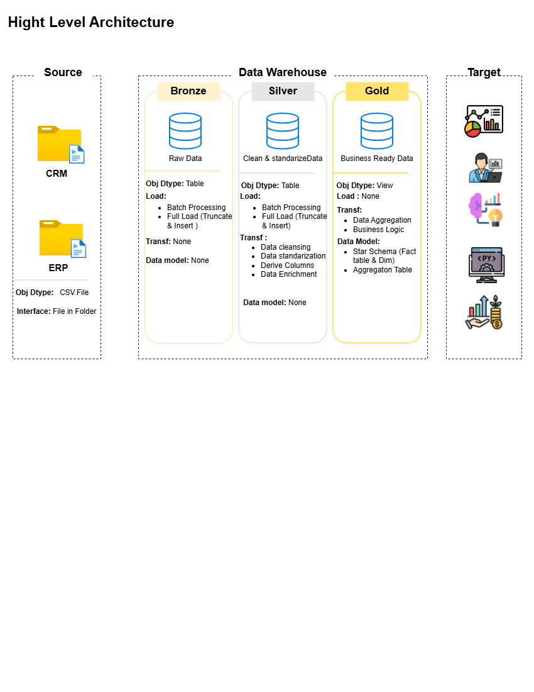

# 🚀 SQL Data Warehouse Project

> End-to-End Data Warehouse Solution using SQL Server, ETL Pipelines, Dimensional Modeling, and Medallion Architecture

<p align="center">
  <strong>Transforming Raw CRM & ERP Data into Business-Ready Insights</strong>
</p>

---

## 📖 Project Overview

This project demonstrates the design and implementation of a modern enterprise Data Warehouse using SQL Server and industry-standard Data Engineering practices.

The solution integrates data from multiple business systems, applies data quality rules and transformations, and delivers analytics-ready datasets for reporting and business intelligence.

### Key Objectives

- Build a scalable Data Warehouse using Medallion Architecture
- Integrate CRM and ERP source systems
- Implement ETL pipelines using SQL
- Apply Data Quality checks and validation
- Design dimensional models using Star Schema
- Deliver business-ready datasets for analytics

---

## 🏗️ Architecture

The project follows the **Medallion Architecture** pattern.
<p align="center">
  
</p>
### Bronze Layer

**Purpose:** Store raw source data.

**Characteristics**

- Raw ingestion
- Full-load processing
- No business transformations
- Historical traceability

---

### Silver Layer

**Purpose:** Clean and standardize data.

**Transformations**

- Remove duplicates
- Handle null values
- Standardize formats
- Data enrichment
- Derived columns

---

### Gold Layer

**Purpose:** Deliver analytics-ready datasets.

**Features**

- Star Schema
- Fact Tables
- Dimension Tables
- Business Logic
- KPI-ready datasets

---

## 📂 Repository Structure

```text
SQL_Data_Warehouse_Project
│
├── Datasets/
│
├── Docs/
│   ├── DATA MODELING.drawio
│   ├── DATA MODELING.drawio.png
│   ├── Data Flow Diagram.drawio
│   ├── Data Flow Diagram.drawio.png
│   ├── High_level_data_architecture.drawio
│   ├── High_level_data_architecture.drawio.png
│   └── data_catalog.md
│
├── Scripts/
│   ├── bronze/
│   ├── silver/
│   ├── gold/
│   └── init_database.sql
│
├── Tests/
│   └── quality_checks_silver.sql
│
└── README.md
```

---

## ⚙️ Technology Stack

| Category | Technology |
|-----------|-----------|
| Database | SQL Server |
| Language | T-SQL |
| Architecture | Medallion Architecture |
| Modeling | Star Schema |
| Documentation | Markdown |
| Diagramming | Draw.io |
| Version Control | Git & GitHub |

---

## 🔄 ETL Pipeline

### Extract

Source Systems:

- CRM
- ERP

Format:

- CSV Files

### Transform

Data processing includes:

- Data Cleansing
- Standardization
- Validation
- Business Rule Implementation
- Attribute Derivation

### Load

Data is loaded through:

```text
Source → Bronze → Silver → Gold
```

Final outputs are optimized for reporting and analytics.

---

## 📊 Data Model

The Gold Layer follows dimensional modeling best practices.

<p align="center">
  
</p>

### Dimension Tables

#### dim_customer

Stores customer-related attributes used for:

- Customer Analysis
- Segmentation
- Reporting

#### dim_product

Stores product-related attributes used for:

- Product Analytics
- Category Reporting
- Performance Monitoring

### Fact Tables

#### fact_sales

Stores transactional sales metrics used for:

- Revenue Analysis
- Sales Trends
- KPI Tracking
- Business Reporting

---

## ✅ Data Quality Framework

Data quality checks are implemented to ensure trust and reliability.

### Validation Checks

- Duplicate Detection
- Null Value Validation
- Referential Integrity Checks
- Data Consistency Verification
- Business Rule Enforcement

Example:

```sql
SELECT customer_id,
       COUNT(*)
FROM silver.crm_customer_info
GROUP BY customer_id
HAVING COUNT(*) > 1;
```

---

## 📚 Documentation

The project includes comprehensive documentation.

| Document | Description |
|-----------|-------------|
| Data Catalog | Metadata and business definitions |
| Data Flow Diagram | Data movement across layers |
| Data Modeling | Star Schema design |
| Architecture Diagram | High-level warehouse architecture |

---

## 📈 Business Use Cases

### Sales Analytics

- Revenue Tracking
- Product Performance
- Trend Analysis

### Customer Analytics

- Customer Segmentation
- Behavioral Analysis
- Retention Insights

### Executive Reporting

- KPI Monitoring
- Business Performance Analysis
- Strategic Decision Making

---

## 🎯 Skills Demonstrated

### Data Engineering

- ETL Development
- Data Warehousing
- Data Integration
- Data Transformation

### Analytics Engineering

- Data Modeling
- Business Layer Design
- Metrics Development

### SQL Development

- Views
- Stored Procedures
- Data Validation
- Query Optimization

### Data Quality

- Validation Rules
- Consistency Checks
- Referential Integrity

---

## 🚀 Future Enhancements

- Incremental Loading
- Change Data Capture (CDC)
- SQL Agent Automation
- Power BI Dashboard Integration
- CI/CD Pipeline
- Cloud Deployment (Azure/AWS)

---

## 👨‍💻 Author

### Djibe Christian Diguina

Aspiring Data Engineer | Data Analyst | Analytics Engineer

**Connect with me**

- LinkedIn: https://linkedin.com/in/your-linkedin
- Portfolio: https://your-portfolio.com
- GitHub: https://github.com/your-github

---
